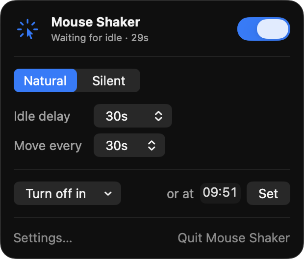
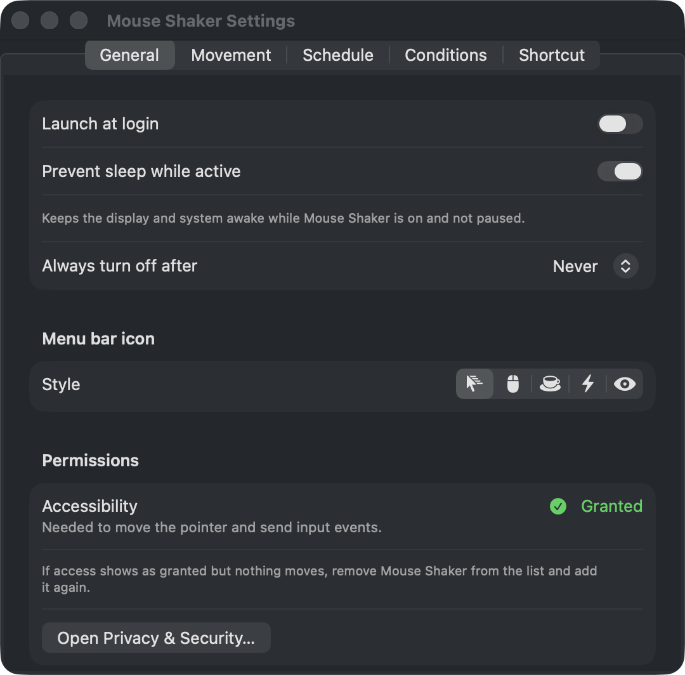
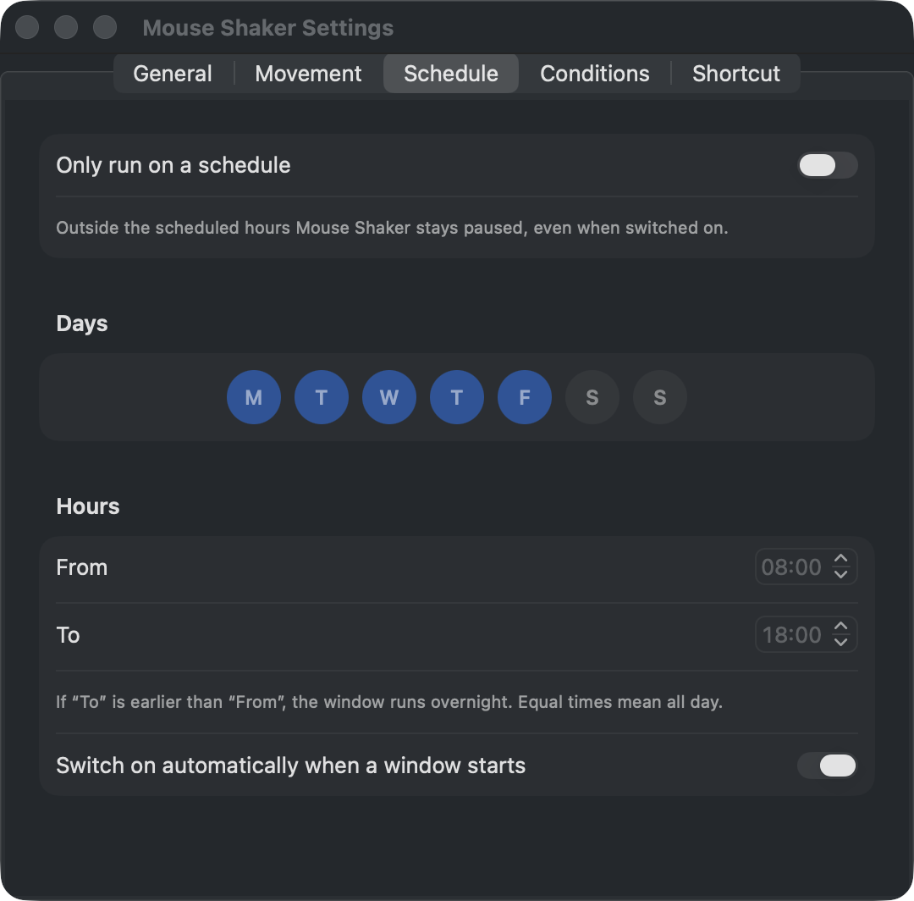

# Mouse Shaker

A native macOS menu bar app that keeps your Mac awake and your status active while you are away from the keyboard. It nudges the pointer, or sends a zero-distance input event, only after a configurable idle delay, and it respects schedules, app conditions and timers.

Built with Swift and SwiftUI. It needs no Xcode project, only the Command Line Tools, and has no third-party dependencies.

<p align="center">
  
  
</p>

## Features

**Movement**
- **Natural mode** moves the pointer along a short curved path (2 to 30 pt) and returns it exactly to where it started.
- **Silent mode** sends a pointer event with zero displacement. The pointer does not move, but the system idle timer resets.
- **Extra activity** (optional):
  - a silent key press (F18, which macOS does not bind to anything);
  - a one-pixel scroll and back, vertical, horizontal or both;
  - clicks at positions you pick on screen, one per action, in turn.
- **Continuous mode** acts every second instead of waiting for the interval.

**Timing**
- **Idle delay:** waits this long after your last real input before starting.
- **Move every:** the interval between actions.
- **Schedule:** choose weekdays and a *From* / *To* window. A window whose *To* is earlier than its *From* runs overnight. The app can switch itself on when a window starts.
- **Turn off in** (15 min to 12 h), **Turn off at** a set time (one-shot), and **Always turn off after** a duration.

**Conditions**
- **App condition:** run only while an app is running, is in front, or is not in front.
- **Pauses:**
  - while the screen is locked;
  - during fast user switching;
  - while another app's menu or the screenshot tool is open.
- **Low battery:** switches off on battery at or below a threshold.
- **Real input always wins.** Any real mouse, trackpad, scroll or keyboard input pauses the app until the idle delay passes again.

**System**
- **Prevent sleep while active:** holds an IOPM assertion, visible in `pmset -g assertions`.
- **Launch at login:** uses `SMAppService`.
- **Global shortcut:** ⌃⌘J by default, customizable in Settings.
- **Menu bar icon:** five styles, and the icon reflects the current state (off, waiting, active, paused).
- **Accessibility:** respects Reduce Motion.
- **Localized** in English, Portuguese (Brazil) and Spanish.

<p align="center">
  
</p>

## Install

1. Download `MouseShaker-<version>.zip` from [Releases](https://github.com/Dumorro/mouse-shaker/releases/latest). It is a universal app for Apple silicon and Intel Macs running macOS 13 or later.
2. Unzip it and move **Mouse Shaker.app** to `/Applications`.
3. The build is ad-hoc signed and not notarized by Apple, so Gatekeeper blocks it the first time you open it. Either:
   - try to open it once, then click **Open Anyway** in System Settings › Privacy & Security; or
   - if macOS reports the app as damaged, clear the download quarantine flag:
     ```sh
     xattr -dr com.apple.quarantine "/Applications/Mouse Shaker.app"
     ```
4. Grant Accessibility access when asked (see [below](#accessibility-permission)).

## Requirements for building

- macOS 13 Ventura or later.
- Swift 6 toolchain: the Xcode Command Line Tools (`xcode-select --install`) are enough.

## Build and run

```sh
make app       # builds "build/Mouse Shaker.app" (ad-hoc signed)
make run       # builds and opens the app
make install   # copies the app to /Applications and opens it
make release   # universal (arm64 + x86_64) app, zipped into build/MouseShaker-<version>.zip
```

To sign with a real identity instead of ad-hoc:

```sh
SIGN_ID="Developer ID Application: Your Name (TEAMID)" make app
```

## Accessibility permission

macOS only lets an app move the pointer or post input events after you grant **Accessibility** access, under System Settings › Privacy & Security › Accessibility. On macOS 27 and later the setting is called *Device Control and Data Access*. The app shows a banner with a shortcut to the right pane until access is granted.

An ad-hoc signature changes with every build. After a rebuild, macOS keeps showing the old grant as enabled, but it no longer applies. Reset the grant, then allow it again:

```sh
make reset-perms   # tccutil reset Accessibility dev.dumorro.mouseshaker
```

## Development

```sh
make test                          # unit tests (Swift Testing)
make logs                          # stream the app's os_log output
python3 scripts/check-strings.py   # fails if any UI string lacks a translation
```

With only the Command Line Tools installed, Swift Testing is not on SwiftPM's default search paths. The `Makefile` adds the needed flags automatically when `xcode-select -p` points to the Command Line Tools.

### Project layout

| Path | Contents |
|---|---|
| `Sources/ShakerCore` | Pure, unit-tested logic with no AppKit: `Settings` (tolerant decoding), `Schedule`, deactivation timers, `EngineStateMachine`, which decides the status and whether to act on each tick, and `MotionPath`, the Natural-mode path generator. |
| `Sources/MouseShaker` | The app: `JiggleEngine` (1 s tick), `InputSynthesizer` (CGEvent posting), `ActivityMonitor` (listen-only event tap), `SystemMonitors` (session, battery, apps, menus), the Carbon global hotkey, and the SwiftUI views. |
| `Tests/ShakerCoreTests` | Swift Testing suites for the core logic. |
| `Resources` | `Info.plist` and the `*.lproj` string tables. |
| `scripts` | Bundle assembly, icon generation and the translation coverage check. |

### How real input is told apart

The system idle counters are reset by synthetic events too, so the app cannot use them to detect you. Instead, every event the app posts is tagged in `eventSourceUserData`. A listen-only event tap then records the time of the last *untagged* event. It stores only that timestamp, never key codes or text.

### Adding a language

1. Copy `Resources/es.lproj` to `Resources/<code>.lproj` and translate the values.
2. Add the code to `CFBundleLocalizations` in `Resources/Info.plist`.
3. Run `python3 scripts/check-strings.py` until it passes.

## Privacy

Mouse Shaker makes no network connections and collects no data. Its settings stay in the app's local `UserDefaults` domain.

## License

[MIT](LICENSE) © 2026 Thiago Dumorro

